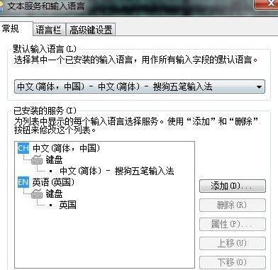

#+TITLE: 说明文档
[[https://melpa.org/#/sis][file:https://melpa.org/packages/sis-badge.svg]]

[[./README.org][English Version]]

* 关于
~sis~ (smart input source) 可以最小化在 Emacs 中手动切换输入源（输入法）的需求，
对原生和操作系统的输入源（输入法）都有效：

- 全局模式： ~sis-global-respect-mode~ 使输入源适应不同的缓冲区/模式
  1. 启动时适应：以指定语言启动 Emacs
  2. 适应 ~evil~ ：离开 ~evil~ 的 ~insert~ 模式时切换到英文
  3. 适应 ~minibuffer~ ：进入 ~minibuffer~ 时切换到英文
  4. 适应前缀键：按下 ~C-c~ / ~C-x~ / ~C-h~ 等前缀键时切换到英文
  5. 适应缓冲区：缓冲区重新获得焦点时恢复其输入源
- 缓冲区本地模式： ~sis-context-mode~ 根据上下文智能切换输入源
  该模式也有一个全局版本 ~sis-global-context-mode~ 可为所有缓冲区启用。
  可以通过一个变量轻松配置何时根据上下文切换输入源，其默认值表示在进入
  ~evil~ 插入模式时进行切换。
- 缓冲区本地模式： ~sis-inline-mode~ 启用临时覆盖层功能，可自动触发
  输入英文/其他语言，然后无需手动切换即可恢复原始输入源。该模式也有一个
  全局版本 ~sis-global-inline-mode~ 可为所有缓冲区启用。
- 全局模式： ~sis-global-cursor-color-mode~ 根据当前输入源自动
  改变光标颜色。

* 特性
1. 便于使用操作系统原生输入源，无需改变使用习惯
2. 便于使用 Emacs 原生输入源，提供更好的兼容性
3. 支持图形界面 Emacs 和终端 Emacs
4. 安装配置简单。在 ~GUI Emacs Mac Port~ 下使用搜狗输入法无需额外配置
5. 根据当前输入源自动改变光标颜色
6. 使输入源适应不同的缓冲区/模式：
   1) 启动时适应：以指定语言启动 Emacs
   2) 适应 ~evil~ ：离开 ~evil~ 的 ~insert~ 模式时切换到英文
   3) 适应 ~minibuffer~ ：进入 ~minibuffer~ 时切换到英文
   4) 适应前缀键：按下 ~C-c~ / ~C-x~ / ~C-h~ 等前缀键时切换到英文
   5) 适应缓冲区：缓冲区重新获得焦点时恢复其输入源
7. 支持 ~内联英文~ 和 ~内联其他语言~ 区域。内联区域特性（以 ~内联英文~ 为例）：
   1) 在非英文字符周围插入空格触发区域（~内联其他语言~ 需要连续两个空格）
   2) 在此模式下，将保持英文输入
   3) 区域在以下情况关闭：
      a. 光标离开区域
      b. 按下回车键
      c. 输入两个连续空格（可配置为一个空格）
   4) 如果区域以空格结束，将选择非英文输入源，否则保持英文输入源
   5) 区域关闭后，头尾各删除一个空格（如果存在）。但如果整个区域都是空白，则不删除任何字符

* 安装
直接从 ~melpa~ 安装 ~sis~ 即可。

* 准备输入源管理器（ISM）
** Emacs 原生输入法
以下以 ~rime~ 为例：
#+BEGIN_SRC lisp
(sis-ism-lazyman-config nil "rime" 'native)
#+END_SRC

** MacOS
以下是默认的 MacOS 输入源配置。
#+BEGIN_SRC lisp
;; 如果你的输入源与默认值相同则无需设置
(sis-ism-lazyman-config
 "com.apple.keylayout.US"
 "com.sogou.inputmethod.sogou.pinyin")
#+END_SRC

注意：
1. 你的英文输入源*可能不是*默认值。使用 Emacs 中的 ~sis-get~ 命令获取正确的值。
2. 根据使用场景，需要安装 ~EMP~ 或 ~macism~ 。

*** GUI Emacs Mac Port (EMP)
EMP 是一个为 MacOS 增强的 Emacs 发行版。它内置了与 MacOS 输入源高效交互的原生 API。
可以通过以下命令安装 EMP：
#+BEGIN_SRC bash
brew tap railwaycat/emacsmacport
brew install emacs-mac --with-modules --with-rsvg --with-imagemagick --with-natural-title-bar
#+END_SRC

*** ~macism~
如果你的 Emacs 不是 GUI EMP，则需要安装预配置的 ~macism~ 。
#+BEGIN_SRC bash
brew tap laishulu/homebrew
brew install macism
#+END_SRC
注意：
- 当你第一次在应用中使用 ~macism SOME_INPUT_SOURCE_ID~ 时，MacOS 会弹出窗口请求授予辅助功能权限，
  你也可以按照 [[https://github.com/laishulu/macism/][macism]] 中的说明手动授予权限。
- 在较慢的电脑上， ~macism~ 需要比默认值更长的睡眠时间（以微秒计）才能与辅助功能一起工作。
  可以通过以下代码覆盖默认值：
  #+BEGIN_SRC lisp
(setq sis-do-set
      (lambda(source) (start-process "set-input-source" nil "macism" source "50000")))
  #+END_SRC
- 不要在 TUI Emacs 中使用 ~Alacritty~ ，因为当输入法开启时，它无法正确处理删除键以及 ~Option~ 和 ~Command~ 键。
  在 ~Alacritty~ 修复这些长期存在的 bug 之前，我建议使用 ~kitty~。
- 如果你在为 Emacs 授予辅助功能权限时遇到问题，请参见下文：
  #+BEGIN_QUOTE
  某些 Emacs "发行版"将多个适用于不同 macOS 版本的 Emacs 二进制文件打包在一个文件夹中，并在运行时动态选择适合你系统的版本。
  这意味着你点击启动程序的图标实际上是一个"占位符"，它本身不是 Emacs，而只是用来启动 Emacs。这个"占位符"通常是一个 Ruby 脚本。
  如果是这种情况，你需要将 Ruby 程序拖到权限列表中。Ruby 是 macOS 默认自带的。你可以通过打开访达，然后从"前往"菜单选择
  "前往文件夹"来找到这个程序。输入 "/usr/bin"，访达就会打开该文件夹。在文件夹中，你会找到可以拖到辅助功能列表中的 ruby 程序。
  #+END_QUOTE

** Microsoft Windows
*** ~w32~
~Emacs 28+~ 在 Windows 下提供了无需借助外部工具即可直接切换输入法的 API。 ~sis~ 内置支持这些 API，并将其归类为 ~w32~ 类型的输入源管理器，会自动检测并配置。因此以下代码实际上并不需要。
#+BEGIN_SRC lisp
; (sis-ism-lazyman-config nil t 'w32)
#+END_SRC

*** ~im-select~
[[https://github.com/daipeihust/im-select][im-select]] 可以在 Microsoft Windows 下作为 ~macism~ 的替代品使用。
#+BEGIN_SRC lisp
(sis-ism-lazyman-config "1033" "2052" 'im-select)
#+END_SRC

1. 尽管 ~im-select~ 支持切换不同的输入语言，但它不支持同一语言下的多个输入法，因此你需要
   确保每种输入语言只有一个输入法，就像下面的截图所示。
   #+CAPTION: Smart input source
   
2. 如果你使用 ~win~ 键作为 ~super~ 键，你可能还需要 [[https://github.com/laishulu/winsuper][winsuper]]。

** Linux
*** ~fcitx~
#+BEGIN_SRC lisp
(sis-ism-lazyman-config "1" "2" 'fcitx)
#+END_SRC

*** ~fcitx5~
#+BEGIN_SRC lisp
(sis-ism-lazyman-config "1" "2" 'fcitx5)
#+END_SRC

*** ~ibus~
#+BEGIN_SRC lisp
(sis-ism-lazyman-config "xkb:us::eng" "OTHER_INPUT_SOURCE" 'ibus)

** 配置输入源管理器（ISM）的内部机制
配置 ISM 的核心在于以下两个变量：
#+BEGIN_SRC lisp
(setq sis-do-get
      #'YOUR_DO_GET_INPUT_SOURCE_FUNCTION)
(setq sis-do-set
      #'YOUR_DO_SET_INPUT_SOURCE_FUNCTION)
#+END_SRC

默认已为 ~EMP~ 和 ~macism~ 提供了这些功能。

如果你有一个输入源管理器 ~YOUR_ISM~ ：
+ 运行 ~YOUR_ISM~ 将输出当前输入源
+ 运行 ~YOUR_ISM INPUT_SOURCE_ID~ 将选择 ~INPUT_SOURCE_ID~

那么你可以简单地将 ~YOUR_ISM~ 作为 ~macism~ 的替代品：
#+BEGIN_SRC lisp
(setq sis-external-ism "YOUR_ISM")
#+END_SRC

你可以自行配置 ISM，不过为了方便起见，也提供了 ~sis-ism-lazyman-config~ 命令用于配置常见的输入源管理器。
#+END_SRC

* 配置
该模式经过精心设计，所以即使缓冲区全为英文内容也可以安全地启用。

#+BEGIN_SRC lisp
(use-package sis
  ;; :hook
  ;; 为指定的缓冲区启用 /context/ 和 /inline region/ 模式
  ;; (((text-mode prog-mode) . sis-context-mode)
  ;;  ((text-mode prog-mode) . sis-inline-mode))

  :config
  ;; 用于 MacOS
  (sis-ism-lazyman-config

   ;; 英文输入源可能是："ABC"、"US" 或其他
   ;; "com.apple.keylayout.ABC"
   "com.apple.keylayout.US"

   ;; 其他语言输入源："rime"、"sogou" 或其他
   ;; "im.rime.inputmethod.Squirrel.Rime"
   "com.sogou.inputmethod.sogou.pinyin")

  ;; 启用 /光标颜色/ 模式
  (sis-global-cursor-color-mode t)
  ;; 启用 /respect/ 模式
  (sis-global-respect-mode t)
  ;; 为所有缓冲区启用 /context/ 模式
  (sis-global-context-mode t)
  ;; 为所有缓冲区启用 /inline english/ 模式
  (sis-global-inline-mode t)
  )
#+END_SRC

提示：
1. 对于 ~spacemacs~，如果在 ~hybrid~ 模式下工作，某些与 ~evil~ 相关的功能可能无法正常工作。请改用 ~vim~ 模式。
2. 在调用 ~sis~ 命令之前，请确保你的 ISM 可用（在你的 ~$PATH~ 中）。

** 关于 /内联英文模式/

例如，要得到最终文本 ~中文 some english text 中文~ ，只需输入 ~中文<spc>some
english text<spc><RET>中文~ ，无需手动切换输入法。

* 变量和命令
** 关于输入源
| 变量                       | 描述                                   | 默认值                               |
|----------------------------+----------------------------------------+--------------------------------------|
| ~sis-english-source~       | 英文输入源                             | ~com.apple.keylayout.US~             |
| ~sis-other-source~         | 其他语言输入源                         | ~com.sogou.inputmethod.sogou.pinyin~ |
| ~sis-external-ism~         | 外部输入源管理器                       | ~macism~                             |
| ~sis-do-get~               | 获取当前输入源的函数                   | 由环境决定                           |
| ~sis-do-set~               | 设置输入源的函数                       | 由环境决定                           |
| ~sis-change-hook~          | 输入源改变后执行的钩子                 | ~nil~                                |
| ~sis-auto-refresh-seconds~ | 从操作系统自动刷新输入源的空闲时间间隔 | ~0.2~，设为 ~nil~ 可禁用             |
|----------------------------+----------------------------------------+--------------------------------------|

注意：
- 为了节省能量，在长时间空闲期间，从操作系统刷新输入源的实际间隔会自动增加。

| 命令名称                 | 描述                           |
|--------------------------+--------------------------------|
| ~sis-ism-lazyman-config~ | 配置输入源管理器               |
| ~sis-get~                | 获取输入源                     |
| ~sis-set-english~        | 将输入源设置为英文             |
| ~sis-set-other~          | 将输入源设置为其他语言         |
| ~sis-switch~             | 在英文和其他语言输入源之间切换 |
|--------------------------+--------------------------------|

** 关于光标颜色模式
| 变量                       | 描述                           | 默认值                 |
|----------------------------+--------------------------------+------------------------|
| ~sis-default-cursor-color~ | 默认光标颜色，也用于英文输入时 | ~nil~ （从环境中获取） |
| ~sis-other-cursor-color~   | 其他语言输入源的光标颜色       | ~green~                |
|----------------------------+--------------------------------+------------------------|

** 关于 respect 模式
| 变量                                            | 描述                                      | 默认值                 |
|-------------------------------------------------+-------------------------------------------+------------------------|
| ~sis-respect-start~                             | 模式启用时切换到特定输入源                | ~'english~             |
| ~sis-respect-evil-normal-escape~                | 即使在 evil 普通状态下也用 esc 切换到英文 | ~t~                    |
| ~sis-respect-prefix-and-buffer~                 | 处理前缀键和缓冲区                        | ~t~                    |
| ~sis-respect-go-english-triggers~               | 额外的保存输入源并切换到英文的触发器      | ~t~                    |
| ~sis-respect-restore-triggers~                  | 额外的恢复输入源的触发器                  | ~nil~                  |
| ~sis-respect-minibuffer-triggers~               | 在迷你缓冲区中设置输入源的命令触发器      | 见变量文档             |
| ~sis-prefix-override-keys~                      | 需要被适应的前缀键                        | ~'("C-c" "C-x" "C-h")~ |
| ~sis-prefix-override-buffer-disable-predicates~ | 用于禁用前缀覆盖的缓冲区谓词              | 见变量文档             |
|-------------------------------------------------+-------------------------------------------+------------------------|

** 关于语言模式
| 变量                  | 描述                   | 默认值        |
|-----------------------+------------------------+---------------|
| ~sis-english-pattern~ | 识别英文字符的模式     | ~[a-zA-Z]~    |
| ~sis-other-pattern~   | 识别其他语言字符的模式 | CJK字符和标点 |
| ~sis-blank-pattern~   | 识别空白字符的模式     | ~[:blank:]~   |
|-----------------------+------------------------+---------------|

** 关于上下文模式
| 变量                          | 描述                   | 默认值     |
|-------------------------------+------------------------+------------|
| ~sis-context-detectors~       | 用于检测上下文的检测器 | 见变量文档 |
| ~sis-context-fixed~           | 上下文固定为特定语言   | ~nil~      |
| ~sis-context-aggressive-line~ | 跨空白行积极检测上下文 | ~t~        |
| ~sis-context-hooks~           | 触发上下文跟随的钩子   | 见变量文档 |
| ~sis-context-triggers~        | 触发上下文跟随的命令   | 见变量文档 |
|-------------------------------+------------------------+------------|

** 关于内联模式
| 面 / 变量                             | 描述                                        | 默认值 |
|---------------------------------------+---------------------------------------------+--------|
| ~sis-inline-face~                     | 内联区域覆盖层的面                          |        |
| ~sis-inline-not-max-point~            | 当整个缓冲区以该区域结尾时插入新行          | ~t~    |
| ~sis-inline-tighten-head-rule~        | 删除头部空格的规则                          | ~'one~ |
| ~sis-inline-tighten-tail-rule~        | 删除尾部空格的规则                          | ~'one~ |
| ~sis-inline-single-space-close~       | 使用 1 个空格关闭区域，默认是 2 个空格/回车 | ~nil~  |
| ~sis-inline-with-english~             | 启用"内联英文"区域功能                      | ~t~    |
| ~sis-inline-with-other~               | 启用"内联其他语言"区域功能                  | ~nil~  |
| ~sis-inline-english-activated-hook~   | 内联英文区域激活后运行的钩子                | ~nil~  |
| ~sis-inline-english-deactivated-hook~ | 内联英文区域停用后运行的钩子                | ~nil~  |
| ~sis-inline-other-activated-hook~     | 内联其他语言区域激活后运行的钩子            | ~nil~  |
| ~sis-inline-other-deactivated-hook~   | 内联其他语言区域停用后运行的钩子            | ~nil~  |
|---------------------------------------+---------------------------------------------+--------|

* How to
** 获取输入源 ID
在配置好/输入源管理器/后，你可以通过 ~sis-get~ 命令获取你的/当前输入源 ID/。

** 通知包输入源变更
1. 如果你的输入源是通过 ~sis~ 切换的，那么一切都应该自然运行正常。
   你甚至可以将 ~sis-auto-refresh-seconds~ 设置为 ~nil~。
2. 如果你的输入源是从操作系统切换的，为了及时检测到切换，
   ~sis-auto-refresh-seconds~ 不应该设置得太大。
3. 为了节省能量，如果在 Emacs 长时间空闲期间从操作系统切换了输入源，
   包不会及时感知到。这时你可以在 Emacs 中做任何操作来退出长时间空闲状态，
   或直接调用 ~sis-get~ 命令来通知包。

** 为 /org capture/ 缓冲区自动设置/其他/输入源
#+begin_src elisp
(add-hook 'org-capture-mode-hook #'sis-set-other)
#+end_src

** 自定义上下文检测器
像下面这样自定义 ~sis-context-detectors~ ：
#+begin_src elisp
(add-to-list 'sis-context-detectors
             (lambda (&rest _)
               'other))
#+end_src

** 在特定命令的/迷你缓冲区/中自动设置输入源
自定义 ~sis-respect-minibuffer-triggers~ 。

这是一个在命令的/迷你缓冲区/中自动切换到/其他/输入源的示例：
#+begin_src elisp
(add-to-list 'sis-respect-minibuffer-triggers
             (cons 'org-roam-node-find (lambda () 'other)))
#+end_src
